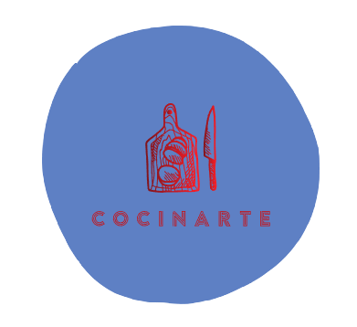
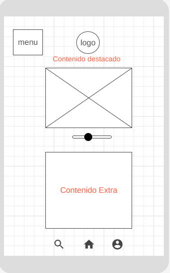
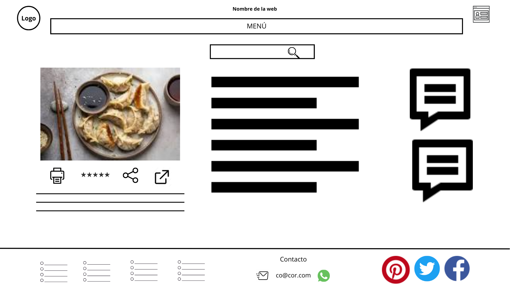

# CocinArte

## DESCRIPCIÓN GENERAL

### Introducción.

En la actualidad hay un gran público que no sabe como cocinar y quiere aprender para comer de manera más saludable o incluso sorprender a su familia o amigos con recetas que les permitan hacer comida de calidad y variada.

#### ¿Por qué has elegido este tema?

Siempre me ha apasionado el mundo de la cocina y me gustaría que todo el mundo tuviera la posibilidad de tener un amplio espectro de recetas para que aprendan que la cocina no es dificil y que todo el mundo puede hacerlo. Quiero compartir mi pasión con el gran público y que se convierta también en la suya.

#### ¿Qué quiero transmitir?

Mi intención es crear una página que este organizada de forma clara y que tenga una navegación sencilla para los usuarios, para transmitirles inspiración culinaria y una gran variedad de recetas con instrucciones detalladas. De igual manera quisiera transmitir que la calidad de los ingredientes es primordial, teniendo que ser estos frescos y saludables. También me gustaría introducir tanto recetas tradicionales, que reflejaran las culturas de distintos paises como su historia, de manera que pudiera crear un mensaje de aprecio por la diversidad culinaria e historia de la gastronomía.
Por otro lado quiero introducir en mi web la posibilidad de que los usuarios comenten, valoren y suban nuevas recetas, de manera que se genere un sentido de comunidad y se fomente la interaccion entre los amantes de la cocina.

### Colores.

#### Justificación

Para mi proyecto he elegido los colores rojo, verde , azul y amarillo. Son tonos no muy saturados de color o pastel, he elegido esta modalidad ya que estos tonos transmiten elegancia, calma y versatilidad, lo que es útil para el contenido de mi página web, por otro lado estos colores suaves son idóneos para realzar el la sensación de apetito por los alimentos y crear un ambiente favorable para los usuarios, proporciaonando una experiencia visual agradable para estos. De igual manera puedo usar estos tonos para jugar con la estacionalidad e pudiendo variar el aspecto de mi página al ofrecer menús especiales de temporada.
El rojo es un color cálido que se asocia de manera habitual con el apetito y la pasión, es muy útil su uso en una página enfocada a la comida ya que puede atraer la atención de los usuarios por las distintas opciones que ofrece mi web. De igual manera es un color que denota energía y emoción, lo que me es ideal para crear un sentido de urgencia o entusiasmo enfocado hacia mis zonas destacadas, como recetas destacadas o eventos culinarios.
El verde se relaciona con la salud, el bienestar, la naturaleza y la sostenibilidad, lo que es adecuado ya que quiero ofrecer recetas saludables y consejos nutricionales, además de promover la compra de productos ecológicos y sostenibles ademas de promover las recetas saludables. Al incluir también menús veganos y vegetarianos puedo usar el verde para transmitir el amor por la naturaleza y productos de origen vegetal.
El azul evova la frescura y la limpieza, lo que es fundamental a la hora de cocinar ya que es mejor hacerlo en un entorno limpio y con productos frescos y de calidad. También transmite calma y confianza lo que puede servir para generar ánimo en los usuarios, haciéndolos sentir cómodos al explorar el contenido y realizar consultas o subir recetas personalizadas.
También evoca el mar y el cielo, lo que puedo asociar a la parte dedicada a la cocina de pescado y de aves.
Y por último el amarillo que se asocia por un lado con la alegria, el optimismo y la calidez, ya que su luminosidad y vitalidad hacen que sea un color que transmite emociones positivas, pudiendo hacer que los usuarios se sientan bienvenidos y felices al interactuar con la página web. También se relaciona con la creatividad, cosa fundamental a la hora de cocinar ya que innovar es necesario a la hora de crear nuevas recetas. De igual manera es un excelente color para resaltar informaciónes clave, como menús del día, promociones especiales o botones de llamada a la acción, lo que facilita la navegación y la toma de decisiones de los usuarios.
Por último me gustaría destacar que tanto la bandera Española, Francesa o Italiana reunen varios de estos colores. Son culturas cuyo reconocimiento culinario está ampliamente estendido y que son referentes de la cocina mediterránea, una de las mas saludables a nivel mundial.

**Captura**
Rojo #FF756B: 
Verde #80E560: 
Azul #5E81C5: 
Amarillo #FFED6B: 

**Fichero HTML**

```
<!DOCTYPE html>
<html lang="en">

<head>
    <meta charset="UTF-8">
    <link rel="stylesheet" href="./style.css">
    <meta name="viewport" content="width=device-width, initial-scale=1.0">
    <title>Colores</title>
</head>

<body>
    <div class="color1">Rojo #FF756B</div>
    <div class="color2">Verde #80E560</div>
    <div class="color3">Azul #5E81C5</div>
    <div class="color4">Amarillo #FFED6B</div>

</body>

</html>

```

**FICHERO CSS**

```
body {
  height: 50em;
  position: relative;
  display: flex;
  align-items: center;
  justify-content: space-around;
}
div {
  width: 15%;
  height: 25%;
  font-size: 20pt;
  font-weight: 600;
  font-family: Verdana, Geneva, Tahoma, sans-serif;
  display: flex;
  position: relative;
  justify-content: space-evenly;
  text-align: center;
  align-items: center;
}
.color1 {
  background-color: #ff756b;
}
.color2 {
  background-color: #80e560;
}
.color3 {
  background-color: #5e81c5;
}
.color4 {
  background-color: #ffed6b;
}

```
### Logo.

En mi logo he utilizado los colores azul y rojo ya que pueden combinarse de manera atractiva si se utilizan de manera equilibrada. También crean un contraste interesante y agradable a la vista que puede atrer la atención de los visitantes de la página web.
Por otro lado he escogido una forma redondeada que contenga la imagen y nombre de la página ya que puede ayudar a dirigir la atención hacia el centro de la composición, de igual manera suelen percibirse como más suaves y amigables en comparación con las formas angulares y puntiagudas, por lo que transmite una sensación acogedora y amigable. La imagen escogida demuestra claramente la intención de mi página, que al ser una tabla con ingredientes y un cuchillo se trnasmite claramente la intencion la página web. 
También he usado las letras en mayúsculas ya que mejoran la legibilidad para el usuario, proporcionan seriedad a la marca y le da una imagen más sólida a mi diseño.

**Logo** 

.

## Diseño

### Bocetos
Presentación de bocetos originales para la página web, tanto el boceto web como el responsive.

**Boceto Web**


**Boceto responsive**


### Wireframes
Presentación de los wireframes avanzados de la Landing Page resposive y web y de una página segundaria tambien en los dos formatos.

**Wireframe Landing Page Web**


**Wireframe Landing Page responsive**




**Wireframe Landing Page secundaria1 Web**



**Wireframe Landing Page Responsive**


### Prototipos
Presentación de las propuestas gráficas avanzados de la Landing Page resposive y web. He realizado algunos cambios sobre los wireframe ya que a la hora de diseñar y mostrar contenido me haa parecido adecuados, he usado la gama de colores elegida. El amarillo de fondo lo he dejado con una saturación muy baja para que fuera casi blanco y no resultara demasiado llamativo.

**Propuesta gráfica Landing Page Web**


**Propuesta gráfica Landing Page Responsive**


